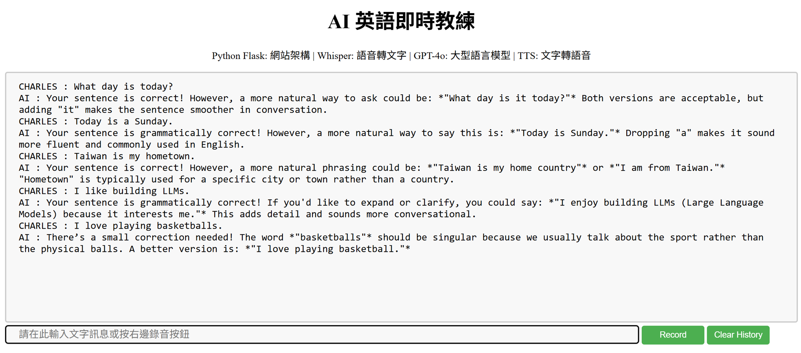
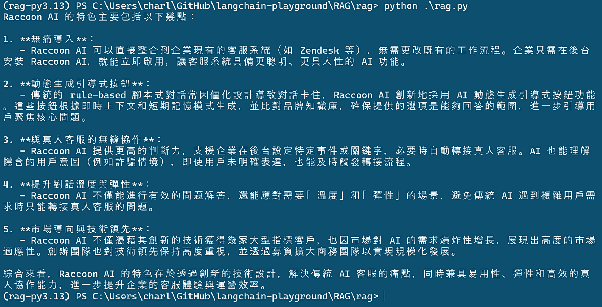

# langchain-labs

## Translator

### Intro
AI 英語即時教練

### Tech Stack
- Python Flask: 網站架構
- Whisper: 語音轉文字
- GPT-4o: 大型語言模型
- TTS: 文字轉語音

### Steps to Run
1. cd Translator
2. poetry install
3. poetry shell
4. cd translator
5. flask run
6. open http://127.0.0.1:5000

### Screenshot

## RAG

### Intro
實作 RAG with LangChain

### Tech Stack
- PyPDFLoader: Load PDF 文件
- RecursiveCharacterTextSplitter: 分割文本
- Qdrant: 向量資料庫
- RunnablePassthrough: LangChain 中一個特殊的 Runnable，它不會改變輸入，而是直接把資料「原樣傳遞」到下一步。

### Steps to Run
1. cd RAG
2. poetry install
3. poetry shell
4. docker run -p 6333:6333 qdrant/qdrant
5. cd rag
6. python rag_pre.py
7. python rag.py

### Screenshot
